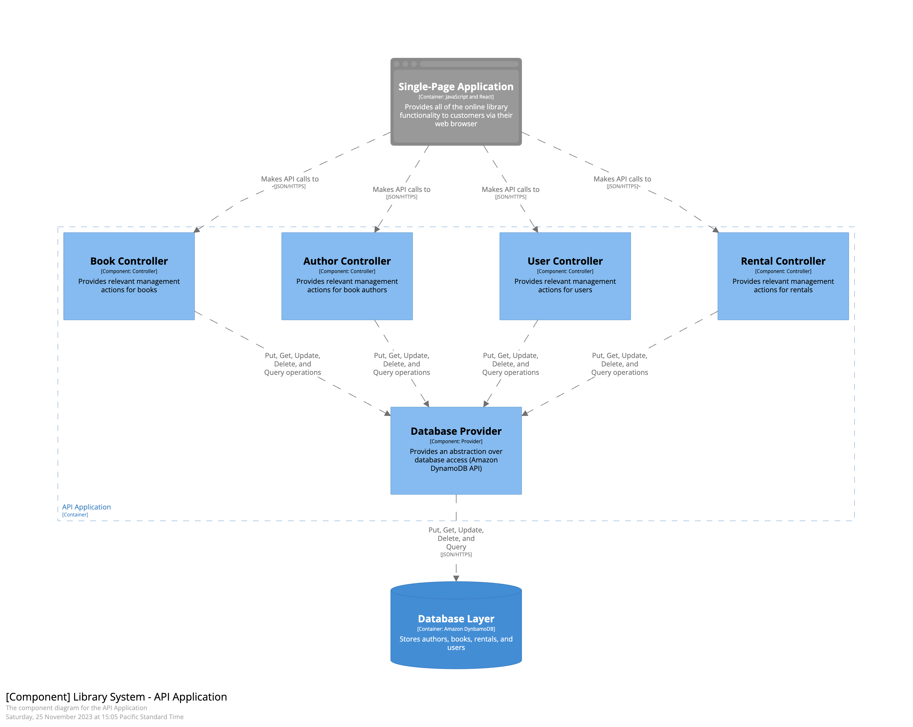

# A Winning Combination: AWS Lambda and CQRS

## Context

This repository is the main asset for the *AWS re:Invent 2023* chalk talk titled: "*A Winning Combination: AWS Lambda and CQRS*" (**[BOA211](https://hub.reinvent.awsevents.com/attendee-portal/catalog/?search=boa211)**).

*Command Query Responsibility Segregation (CQRS)* is often presented as a specific architectural pattern focused on scaling the infrastructure storage layer by separating read and write paths. However, originally this was a code-level pattern that had nothing to do with infrastructure. This exercise explores, how applying this pattern on that level enables new characteristics for designing and later maintaining modern cloud applications - with emphasis on leveraging infrastructural flexibility of *Serverless* architecture and *AWS Lambda*.

## Local Development

Here you can find a list of the recommended prerequisites for this repository.

- Pre-installed tools:
  - [Finch](https://runfinch.com) or any other tool for local container development compatible with *Docker* APIs.
  - Most recent *AWS CLI*.
  - Most recent *AWS SAM CLI*.
  - Node.js in version `18.18.x` or higher.
- Configured profile in the installed *AWS CLI* with credentials for your *AWS IAM* user account of choice.

If you would like to start all the dependent services, run the following commands:

```shell
# After cloning it, inside the the repository root:

$ cd examples
$ finch compose up -d             # ... or `docker compose up -d`
```

Then each directory contains an identical set of commands:

- For [examples/01-from-crud-to-cqrs](./examples/01-from-crud-to-cqrs) and subsequent steps:
  - `npm install` to install all the dependencies.
  - `npm run development` that is bundling the following commands:
    - `npm run lint` to lint the *TypeScript* code.
    - `npm run build` to compile *TypeScript*.
    - `npm run test` to run *Jest* tests.
  - `npm run start` to start a compiled version of the server.
  - `npm run server` to recompile and host the resulting server.
- For [examples/02-deploying-cqrs-in-aws-lambda-environment](./examples/02-deploying-cqrs-in-aws-lambda-environment) and every single collected approach:
  - Inside individual approach directory:
    - Inside `library` directory inside each approach:
      - `npm install` to install all the dependencies.
      - `npm run development` that is bundling the following commands:
        - `npm run lint` to lint the *TypeScript* code.
        - `npm run build` to compile *TypeScript*.
        - `npm run test` to run *Jest* tests.
    - In places, where we have shared *AWS Lambda* layers - invoke `npm install` in the root directory for the approach.
      - And you can use the same set of commands as above in each individual directory inside `layers/` independently.
    - Then, for the *infrastructure as code* (implemented with use of *AWS SAM*):
      - `sam validate`
      - `sam build`
      - `sam deploy`

## Screenplay

### Timetable

A **chalk talk** is an illustrated performance in which the speaker draws pictures to emphasize lecture points and create a memorable and entertaining experience for listeners.

At *AWS re:Invent 2023*, each such session has a timebox of 1 hour, so here is a desired split between both phases:

- Introduction (`00:00 - 00:10`).
- Phase 1: Refactoring from CRUD to CQRS (`00:10 - 00:30`).
  - _Content_: discussion and designing with maximum interactivity.
  - _Outcome_: application with applied CQRS code and architecture level patterns.
- Summary of Phase 1 and Q&A (`00: 30 - 00:35`).
- Phase 2: Deploying CQRS in AWS Lambda Environment (`00:35 - 00:55`).
  - _Content_: discussion and designing with maximum interactivity.
  - _Outcome_: discussing flexibility of various approaches on how it can be deployed in *AWS Lambda* environments.
- Summary of Phase 2 and Q&A (`00:55 - 01:00`).

### Context

Our *use case* for this exercise is a *back-end* of the web application supporting *libraries*.

Example is written in *TypeScript* and starts from a very simplistic *CRUD (Create, Read, Update, Delete)* implementation. First step is available in *[examples/01-from-crud-to-cqrs/step-00-crud](./examples/01-from-crud-to-cqrs/step-00-crud)* directory, and each directory is a further step in the sequence of refining and refactoring even more towards domain-oriented code.

Starting from the initial stage, the internals of the application looks as follows:



Application have 3 entities:

- `Author` with `name` field.
- `User` with fields: `email`, `name`, `status`, and `comment` (as name suggests - relevant to the `status` field).
- `Book` with fields `title`, `isbn` (which is a short for *International Standard Book Number*), `author` (pointing to `Author` entity), `borrower` (pointing to `User` entity), and `status`.

If you have a closer look on the *API*, it is very CRUD-oriented:

```text
POST    /author        creates new author
GET     /author        finds all authors
GET     /author/:id    finds author by id
PUT     /author/:id    updates author by id
DELETE  /author/:id    deletes author by id

POST    /book          creates new book
GET     /book          finds all books
GET     /book/:id      finds book by id
PUT     /book/:id      updates book by id
DELETE  /book/:id      deletes book by id

POST    /user          creates new user
GET     /user          finds all users
GET     /user/:id      finds user by id
PUT     /user/:id      updates user by id
DELETE  /user/:id      deletes user by id
```

### Phase 1: Refactoring from CRUD to CQRS

In this phase, you want for refactor from a *CRUD-like* architecture and representation to something that will represent domain-specific actions.

As an example, you will need to implement just a subset of all available operations - which are:

- Queries:
  - `GetBooksByAuthor` by given author identifier.
  - `GetBorrowedBooksByUser` by given user identifier.
  - `GetMissingBooks` without any additional criteria.
- Commands:
  - `AddNewBook`:
    - Business validation of the provided book entity.
      - Input validation (if all the details allow for processing command) is done earlier.
    - Checking, if author exists.
      - If not, adding author.
    - Adding book with that author, no borrower, and certain status.
  - `BorrowBook`:
    - Business validation of the provided book entity.
      - Input validation (if all the details allow for processing command) is done earlier.
    - Checking if a given book is available.
      - If not, returning error.
    - Updating borrower.
    - Updating book status.
  - `ReportMissingBook`:
    - Business validation of the provided book entity.
      - Input validation (if all the details allow for processing command) is done earlier.
    - Checking, if a given book is available.
      - If not, returning error.
    - Update the given book status.
    - Block the user that borrowed this position, and add annotation in the status about the ID of the  missing book.
    - Remove current borrower from the book.

#### Why do you want a refactor from CRUD to CQRS?

There are a few important reasons collected below:

- Maintainability:
  - Readability.
    - Better understanding due to closer domain representation.
  - Lower complexity = Lower cognitive load.
- Usability:
  - Developer Experience.
  - Promoting Task-based UI.
- Flexibility:
  - Infrastructure-wise.
    - Unit of Deployments.

### Phase 2: Deploying CQRS in AWS Lambda Environment

After introducing a split and separated domain that is domain-oriented and has commands and queries, you will need to evaluate how to deploy such application in the *Serverless* architecture environment using *AWS Lambda* as a main service. That's why you can see various different deployment approaches inside *[examples/02-deploying-cqrs-in-aws-lambda-environment](./examples/02-deploying-cqrs-in-aws-lambda-environment)*.

There are a few very important concepts to emphasise in this phase, so let's iterate one after another.

#### Ports and Adapters

We are talking about [Ports and Adapters (aka *Hexagonal Architecture*)](https://en.wikipedia.org/wiki/Hexagonal_architecture_(software)) pattern, which saved you from rewriting significant parts over and over.

#### Extracting API

Previous step and separation from externalities like *API* definition or input validation (just for making sure that commands and queries are *processable*), allows us for a clean cut and extracting *API definition* to the external service - like *Amazon API Gateway*.

#### Flexibility in Splitting

Another benefit coming from the *Hexagonal Architecture* is ability to cleanly extract different commands/queries independently based on the project needs (e.g., due to scalability or performance reasons).

#### Ability to Replace Service Representation

Last, but not least - extracting externalities allowed us to abstract away interaction-specific details. This way we have introduced *Amazon API Gateway*, however - nothing stops us from introducing (in parts or in a single move) other kinds of triggers e.g., we can trigger certain *AWS Lambda* via message coming from *Amazon SQS* queue or expose our queries via *GraphQL* *API* via *AWS AppSync*.

## Resources

- [*Command-Query Separation*](https://en.wikipedia.org/wiki/Command%E2%80%93query_separation)
- [Martin Fowler on *CQS*](https://martinfowler.com/bliki/CommandQuerySeparation.html)
- [*Command-Query Responsibility Segregation*](https://en.wikipedia.org/wiki/Command_Query_Responsibility_Segregation)
- [Greg Young on *CQRS*](https://cqrs.files.wordpress.com/2010/11/cqrs_documents.pdf)
- [Martin Fowler on *CQRS*](https://martinfowler.com/bliki/CQRS.html)
- [Oskar Dudycz on *CQRS* and *Event Sourcing*](https://event-driven.io/en/event_streaming_is_not_event_sourcing/)
- [Oskar Dudycz on *CQRS* Myths](https://event-driven.io/en/cqrs_facts_and_myths_explained/)
- [*CRUD* to *CQRS* example in .NET by Oskar Dudycz](https://github.com/oskardudycz/EventSourcing.NetCore/tree/main/Sample/CRUDToCQRS)

## Security

See [CONTRIBUTING](CONTRIBUTING.md#security-issue-notifications) for more information.

## License

This repository is licensed under the *MIT-0* License. See the [LICENSE](LICENSE) file.
