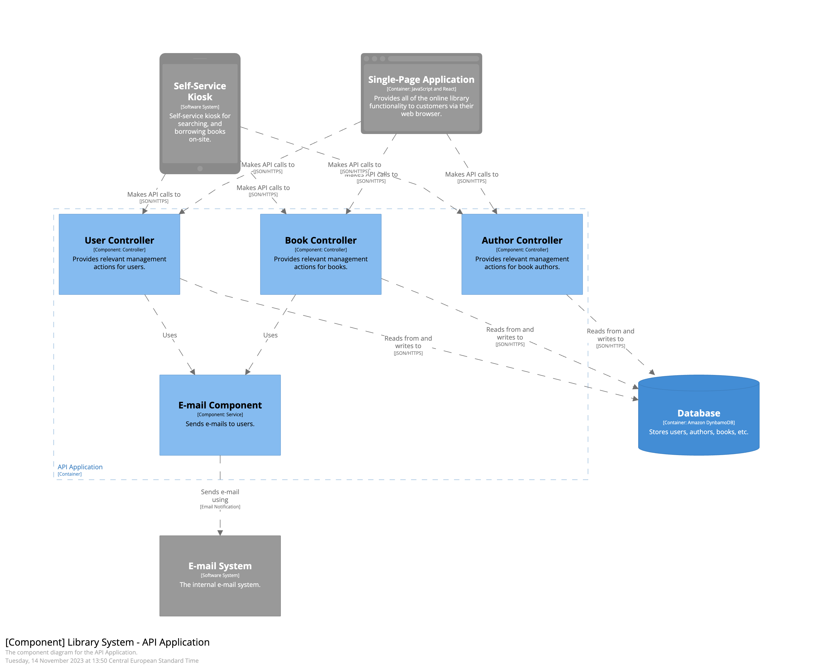

# A Winning Combination: AWS Lambda and CQRS

## Context

This repository is the main asset for the *AWS re:Invent 2023* chalk talk titled: "*A Winning Combination: AWS Lambda and CQRS*" (**[BOA211](https://hub.reinvent.awsevents.com/attendee-portal/catalog/?search=boa211)**).

*Command Query Responsibility Segregation (CQRS)* is often presented as a specific architectural pattern focused on scaling the infrastructure storage layer by separating read and write paths. However, originally this was a code-level pattern that had nothing to do with infrastructure. This exercise explores, how applying this pattern on that level enables new characteristics for designing and later maintaining modern cloud applications - with emphasis on leveraging infrastructural flexibility of *Serverless* architecture and *AWS Lambda*.

## Local Development

Here you can find a list of the recommended prerequisites for this repository.

- Pre-installed tools:
  - [Finch](https://runfinch.com) or any other tool for local container development compatible with *Docker* APIs.
  - Most recent *AWS CLI*.
  - Most recent *AWS SAM CLI*.
  - Python 3.10 or higher.
  - Node.js v21.x or higher.
- Configured profile in the installed *AWS CLI* with credentials for your *AWS IAM* user account of choice.

If you would like to start all the dependent services, run the following commands:

```shell
# After cloning it, inside the the repository root:

$ cd examples
$ finch compose up -d             # ... or `docker compose up -d`
```

## Screenplay

### Timetable

A **chalk talk** is an illustrated performance in which the speaker draws pictures to emphasize lecture points and create a memorable and entertaining experience for listeners.

At *AWS re:Invent 2023*, each such session has a timebox of 1 hour, so here is a desired split between both phases:

- Introduction (`00:00 - 00:10`).
- Phase 1: Refactoring from CRUD to CQRS (`00:10 - 00:30`).
  - _Content_: discussion and designing with maximum interactivity.
  - _Outcome_: application with applied CQRS code and architecture level patterns.
- Summary of Phase 1 and Q&A (`00: 30 - 00:35`).
- Phase 2: Deploying CQRS in AWS Lambda Environment (`00:35 - 00:55`).
  - _Content_: discussion and designing with maximum interactivity.
  - _Outcome_: discussing flexibility of various approaches on how it can be deployed in *AWS Lambda* environments.
- Summary of Phase 2 and Q&A (`00:55 - 01:00`).

### Context

Our *use case* for this exercise is a *back-end* of the web application supporting *libraries*.

Example is written in *TypeScript* and starts from a very simplistic *CRUD (Create, Read, Update, Delete)* implementation (starting here: *[step-00-crud](./examples/01-from-crud-to-cqrs/step-00-crud)* directory).

On that stage, the internals of the application looks as follows:



We have 3 entities:

- `Author` with `name` field.
- `User` with fields: `email`, `name`, `status`, and `statusComment` (as name suggests - relevant to the `status` field).
- `Book` with fields `title`, `isbn` (which is a short for *International Standard Book Number*), `author` (pointing to `Author` entity), `borrower` (pointing to `User` entity), and `status`.

If we have a closer look on the *API*, it is very CRUD-oriented:

```text
POST    /author        creates new author
GET     /author        finds all authors
GET     /author/:id    finds author by id
PUT     /author/:id    updates author by id
DELETE  /author/:id    deletes author by id

POST    /book          creates new book
GET     /book          finds all books
GET     /book/:id      finds book by id
PUT     /book/:id      updates book by id
DELETE  /book/:id      deletes book by id

POST    /user          creates new user
GET     /user          finds all users
GET     /user/:id      finds user by id
PUT     /user/:id      updates user by id
DELETE  /user/:id      deletes user by id
```

### Phase 1: Refactoring from CRUD to CQRS

TODO: Better description.

- Operations:
  - Queries:
    - `GetBooksByAuthor`
    - `GetBorrowedBooksByUser`
    - `GetMissingBooks`
  - Commands:
    - `AddNewBook`.
      - Checking if author exists.
        - If not, adding author.
      - Adding book with that author, no borrower, and certain status.
    - `BorrowBook`
      - Checking if book is available.
        - If not, returning error.
      - Updating borrower.
      - Updating book status.
    - `ReportMissingBook`
      - Update book status.
      - Mark user that borrowed as wrongly behaving.
      - Remove current borrower from the book.

#### Why do we refactor to CQRS from CRUD?

TODO: Better description.

- Maintainability.
  - Readability.
  - Being closer to the domain.
- Usability.
  - Developer Experience.
- Lower cognitive load.
- CRUD vs. Task-based UI.

### Phase 2: Deploying CQRS in AWS Lambda Environment

TODO: Better description.
TODO: Dispatcher concept.
TODO: Ports and Adapters to the rescue from rewriting, due to infrastructure specific changes.

## Resources

- [*Command-Query Separation*](https://en.wikipedia.org/wiki/Command%E2%80%93query_separation)
- [Martin Fowler on *CQS*](https://martinfowler.com/bliki/CommandQuerySeparation.html)
- [*Command-Query Responsibility Segregation*](https://en.wikipedia.org/wiki/Command_Query_Responsibility_Segregation)
- [Greg Young on *CQRS*](https://cqrs.files.wordpress.com/2010/11/cqrs_documents.pdf)
- [Martin Fowler on *CQRS*](https://martinfowler.com/bliki/CQRS.html)
- [Oskar Dudycz on *CQRS* and *Event Sourcing*](https://event-driven.io/en/event_streaming_is_not_event_sourcing/)
- [Oskar Dudycz on *CQRS* Myths](https://event-driven.io/en/cqrs_facts_and_myths_explained/)
- [*CRUD* to *CQRS* example in .NET by Oskar Dudycz](https://github.com/oskardudycz/EventSourcing.NetCore/tree/main/Sample/CRUDToCQRS)

## Security

See [CONTRIBUTING](CONTRIBUTING.md#security-issue-notifications) for more information.

## License

This repository is licensed under the *MIT-0* License. See the [LICENSE](LICENSE) file.
